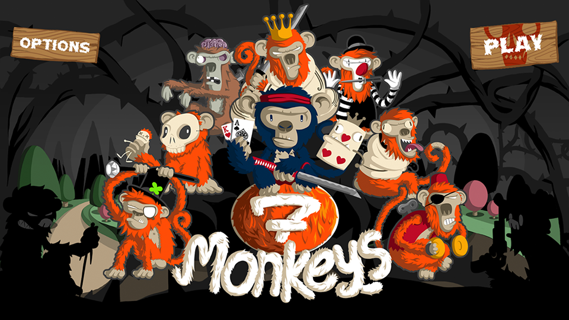
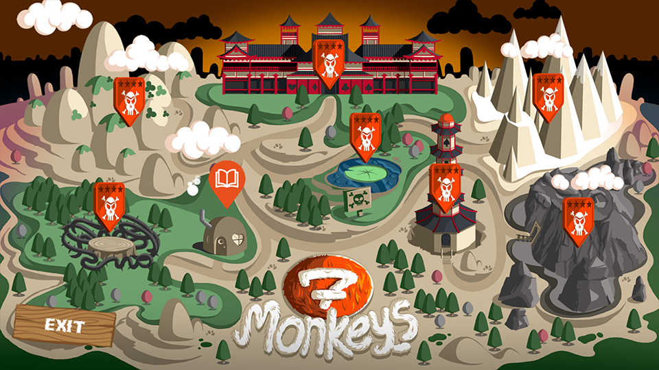
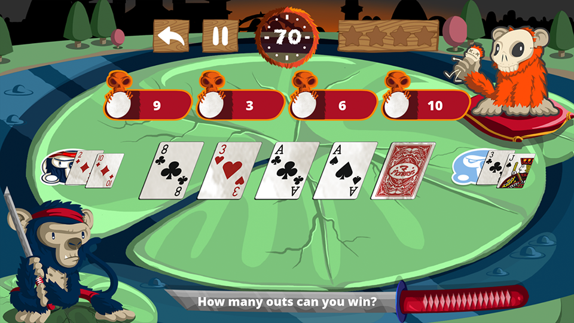

# Seven Monkeys

A Poker Puzzle Game built on the [Cocos2dx-3.X](http://www.cocos2d-x.org/) engine.

**Seven Monkeys** is an engaging puzzle game designed to teach players the rules and mathematics of Texas Hold'em Poker. Through a variety of interactive puzzles, players can learn and practice key poker concepts in an entertaining way.

The game features seven different puzzle types, each with three levels of difficulty, covering the following topics:

- **Poker Hands**: Understanding hand rankings.
- **Poker Positions**: The significance of table positions.
- **Best Hands**: Identifying the strongest hands.
- **Flop Textures**: Analyzing the community cards.
- **Outs**: Calculating potential winning cards.
- **Pot Odds**: Learning betting and odds strategies.
- **Preflop Strategy**: Mastering early-game tactics.

# Screenshots

Take a look at some scenes from the game:

  

  <em>Main Menu</em>

  

  <em>Level Map</em>

  

  <em>Gameplay Table</em>

